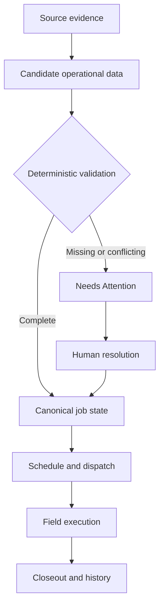
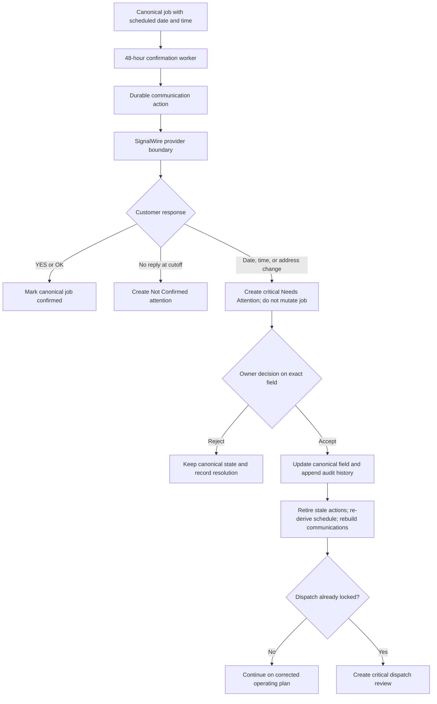
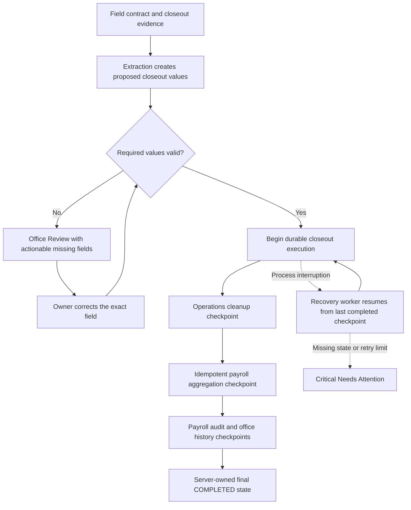

# JobSpark architecture and reliability

This is a public overview of JobSpark's operating model and reliability controls. The implementation and customer configuration are private. The descriptions below are not a substitute for a source review or live production checks.

[Try the demo](https://jobsparksystems.app)

[Product website](https://jobsparksystems.com)

## Tested behavior

These results come from the private repository's GitHub Actions CI on September 7, 2026. The tests below call server commands against the Firestore emulator with synthetic records. They check database outcomes, not screenshots.

| Suite | Passed | What the tests check |
|---|---:|---|
| Closeout integrity | 22/22 | Interrupted closeouts can resume; concurrent and repeated closeouts credit payroll once; invalid closeouts remain in review |
| Crew assignment transactions | 15/15 | Incomplete snapshots and stale plans are rejected; competing plans cannot claim the same mover; rejected requests leave assignment records unchanged |
| Customer change lifecycle | 8/8 | Acceptance replaces old confirmation actions at the corrected 48-hour time, clears prior confirmation, records the decision, and creates critical review for locked dispatch |
| Communications recovery | 6/6 | Confirmed failures retry once; unknown delivery is held for critical review; interrupted accepted sends reconcile; provider dead letters surface and can be requeued |

The customer-change suite also checks rejection, stale evidence, wrong-job and wrong-workspace review items, competing accept/reject requests, and requests left open after a job is underway or finished.

The communications-recovery suite runs simultaneous recovery workers against the same records. It checks that a rejected outbound message produces one retry, uncertain delivery produces no resend, a provider-accepted message repairs one interrupted action, manual mode does not auto-retry, and a dead-letter inbound event can be surfaced and requeued.

One closeout test deliberately fails processing after payroll has been credited. It retries the command and checks that the employee still has three hours, not six. Another submits two closeouts simultaneously and checks for one payroll event and one completion event.

The assignment tests submit two plans competing for one mover. One succeeds. The other is rejected with its job, truck, and plan left unchanged.

These are results from specified test scenarios, not a guarantee for every failure or proof of live provider delivery. Source and CI logs remain private, so this page is a published summary rather than an independently runnable public test suite. Production messaging and worker uptime need separate checks.

## The Operating Problem

Field-service operations rarely fail because information does not exist. They fail because jobs, crews, vehicles, communications, evidence, and exceptions move through disconnected systems with unclear ownership and state.

JobSpark was designed to make the operation itself executable: every job has an explicit state, every important transition has a controlled path, and uncertainty is surfaced before it silently becomes an operational mistake.

## System Model

| Entity | Operational responsibility |
|---|---|
| Workspace | Isolates one company's configuration, users, records, and communication routes |
| Intake | Preserves source evidence and candidate job details |
| Job | Holds the canonical operational record and lifecycle state |
| Queue | Makes the next required operational action visible |
| Crew | Represents availability, skills, assignments, and working state |
| Truck | Coordinates a live dispatched operating unit |
| Communication | Preserves inbound/outbound provider evidence and delivery state |
| Contract | Captures field closeout evidence and extracted candidate values |
| Attention item | Converts missing, contradictory, or uncertain data into an actionable exception |
| Lifecycle event | Provides an auditable record of meaningful state changes |

## Execution Path

The canonical job record is not a free-form AI document. Provider facts and source evidence are preserved first. Extracted details become candidates, deterministic rules decide whether they are operationally usable, and unresolved uncertainty becomes visible work.

## State and Safety Boundaries

- AI may extract, summarize, classify, or recommend.
- AI output does not independently overwrite canonical operational state.
- Recognized commands use explicit transition paths.
- Unknown or contradictory input fails toward review, not silent execution.
- Workspace identity is resolved before operational records are read or written.
- Public-demo activity runs in an isolated synthetic workspace with no customer data.
- Communications preserve provider identifiers and original message evidence.
- Retries are designed to avoid creating duplicate operational work.

## Reliability Design

### Idempotent intake and communications

External providers retry. JobSpark uses stable provider identifiers and deterministic record keys so the same delivery can be recognized instead of creating a second job, message, or exception.

### Controlled lifecycle transitions

Important state changes pass through explicit commands and validation. This keeps UI actions, provider webhooks, and background execution from becoming independent writers with different interpretations of the same job.

### Recoverable side effects

Operational state and external effects, such as communications, are tracked separately. A provider failure can remain visible and retryable without pretending the message was delivered or rolling back unrelated canonical work.

### Actionable uncertainty

Missing dates, addresses, customer details, closeout amounts, or unclear replies become attention items connected to the affected record and required field. The operator resolves the exception and resumes the existing flow.

### Auditable completion

Closeout preserves field evidence, detects missing values, routes incomplete records for review, and records the completed outcome in history and downstream payroll views.

## Communication Architecture

The SignalWire integration includes workspace-aware messaging and staged voice intake. Make remains the active automatic job-intake path. Autonomous mode controls automatic communications only.

Provider configuration, number routing, and production worker operation still need live verification before onboarding. The synthetic demo does not verify message delivery.

The integration contains controls for:

- Inbound provider-message preservation
- Deterministic workspace resolution by configured number
- Duplicate-delivery protection
- STOP and HELP handling
- Delivery-status tracking
- Unknown operational corrections routed to human review
- Media evidence retained for closeout processing

## Customer confirmation and controlled changes

A customer reply can confirm the plan, but it cannot silently rewrite live operations.

This preserves the difference between customer evidence and accepted operating truth. A schedule change also invalidates old confirmation, crew-check-in, and timing actions so the system cannot execute yesterday's plan against today's job.

## Closeout, recovery, and payroll

Completion is a controlled workflow, not a status button.

Each stage records its completion. Replaying the workflow skips completed stages, protects payroll from double counting, and stops unsafe contradictions for owner review. A separate drift worker is designed to check that terminal job, truck, crew, closeout, and payroll markers still agree.

Recent safety fixes also reconcile manual operational edits, require a payroll run to be locked before it can be marked paid, and reject crew plans whose source assignments have changed. These changes passed repository CI. Their deployment status must be checked separately.

## Deployment and Validation

| Layer | Implementation |
|---|---|
| Web application | React, TypeScript, Vite, Tailwind CSS |
| API | Node.js, Express, TypeScript |
| Persistence and identity | Firestore, Firebase Authentication, Firebase Storage |
| Communications | SignalWire |
| Automation and model services | Make, OpenAI, Gemini |
| Delivery | GitHub Actions, Vercel, Render |

Validation focuses on operational invariants rather than screenshots alone: lifecycle transitions, duplicate deliveries, closeout integrity, side-effect resilience, crew replies, access boundaries, and production builds.

## What the demo shows

The public experience uses synthetic data to demonstrate the operating sequence without exposing customer information:

1. Load operational resources.
2. Convert intake into visible queues.
3. Resolve incomplete or non-job calls.
4. Promote jobs according to state and date.
5. Schedule crews and trucks.
6. Lock the dispatch state.
7. Receive field contracts.
8. Route incomplete closeout evidence for review.
9. Process closeout into history and downstream payroll records.

This is a guided synthetic scenario. It does not establish real SMS delivery, worker uptime, or a customer's deployment readiness.

[Enter the JobSpark interactive demo](https://jobsparksystems.app)

## Scope of This Public Proof

This repository intentionally provides the system model and engineering decisions, not the production implementation. The private repository contains the application source, tests, CI configuration, provider integrations, and deployment code.
