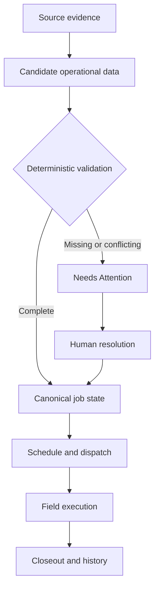

# JobSpark Engineering Proof

> A sanitized technical overview of a deployed live-operations execution system. Production source code, customer configurations, credentials, and security-sensitive implementation details remain private.

[Run the live system](https://jobsparksystems.app) · [Product website](https://jobsparksystems.com)

## The Operating Problem

Field-service operations rarely fail because information does not exist. They fail because jobs, crews, vehicles, communications, evidence, and exceptions move through disconnected systems with unclear ownership and state.

JobSpark was designed to make the operation itself executable: every job has an explicit state, every important transition has a controlled path, and uncertainty is surfaced before it silently becomes an operational mistake.

## System Model

| Entity | Operational responsibility |
|---|---|
| Workspace | Isolates one company's configuration, users, records, and communication routes |
| Intake | Preserves source evidence and candidate job details |
| Job | Holds the canonical operational record and lifecycle state |
| Queue | Makes the next required operational action visible |
| Crew | Represents availability, skills, assignments, and working state |
| Truck | Coordinates a live dispatched operating unit |
| Communication | Preserves inbound/outbound provider evidence and delivery state |
| Contract | Captures field closeout evidence and extracted candidate values |
| Attention item | Converts missing, contradictory, or uncertain data into an actionable exception |
| Lifecycle event | Provides an auditable record of meaningful state changes |

## Execution Path

The canonical job record is not a free-form AI document. Provider facts and source evidence are preserved first. Extracted details become candidates, deterministic rules decide whether they are operationally usable, and unresolved uncertainty becomes visible work.

## State and Safety Boundaries

- AI may extract, summarize, classify, or recommend.
- AI output does not independently overwrite canonical operational state.
- Recognized commands use explicit transition paths.
- Unknown or contradictory input fails toward review, not silent execution.
- Workspace identity is resolved before operational records are read or written.
- Public-demo activity runs in an isolated synthetic workspace with no customer data.
- Communications preserve provider identifiers and original message evidence.
- Retries are designed to avoid creating duplicate operational work.

## Reliability Design

### Idempotent intake and communications

External providers retry. JobSpark uses stable provider identifiers and deterministic record keys so the same delivery can be recognized instead of creating a second job, message, or exception.

### Controlled lifecycle transitions

Important state changes pass through explicit commands and validation. This keeps UI actions, provider webhooks, and background execution from becoming independent writers with different interpretations of the same job.

### Recoverable side effects

Operational state and external effects—such as communications—are tracked separately. A provider failure can remain visible and retryable without pretending the message was delivered or rolling back unrelated canonical work.

### Actionable uncertainty

Missing dates, addresses, customer details, closeout amounts, or unclear replies become attention items connected to the affected record and required field. The operator resolves the exception and resumes the existing flow.

### Auditable completion

Closeout preserves field evidence, detects missing values, routes incomplete records for review, and records the completed outcome in history and downstream payroll views.

## Communication Architecture

JobSpark integrates SignalWire voice and messaging with workspace-aware routing.

Supported safety behavior includes:

- Inbound provider-message preservation
- Deterministic workspace resolution by configured number
- Duplicate-delivery protection
- STOP and HELP handling
- Delivery-status tracking
- Unknown operational corrections routed to human review
- Media evidence retained for closeout processing

## Deployment and Validation

| Layer | Implementation |
|---|---|
| Web application | React, TypeScript, Vite, Tailwind CSS |
| API | Node.js, Express, TypeScript |
| Persistence and identity | Firestore, Firebase Authentication, Firebase Storage |
| Communications | SignalWire |
| Automation and model services | Make, OpenAI, Gemini |
| Delivery | GitHub Actions, Vercel, Render |

Validation focuses on operational invariants rather than screenshots alone: lifecycle transitions, duplicate deliveries, closeout integrity, side-effect resilience, crew replies, access boundaries, and production builds.

## What the Live Demo Proves

The public experience uses synthetic data to demonstrate the operating sequence without exposing customer information:

1. Load operational resources.
2. Convert intake into visible queues.
3. Resolve incomplete or non-job calls.
4. Promote jobs according to state and date.
5. Schedule crews and trucks.
6. Lock the dispatch state.
7. Receive field contracts.
8. Route incomplete closeout evidence for review.
9. Complete history and payroll transitions.

[Enter the JobSpark interactive demo](https://jobsparksystems.app)

## Scope of This Public Proof

This repository intentionally provides the system model and engineering decisions—not the production implementation. The private repository contains the application source, tests, CI configuration, provider integrations, and deployment code.
