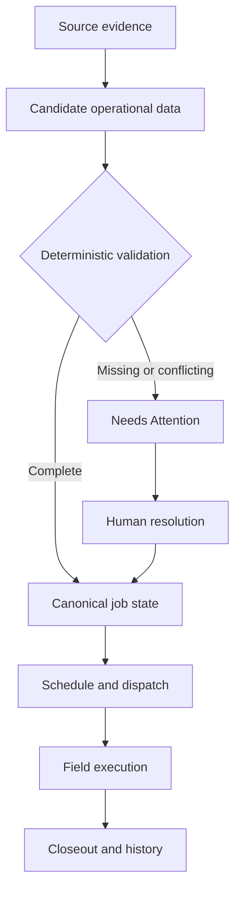
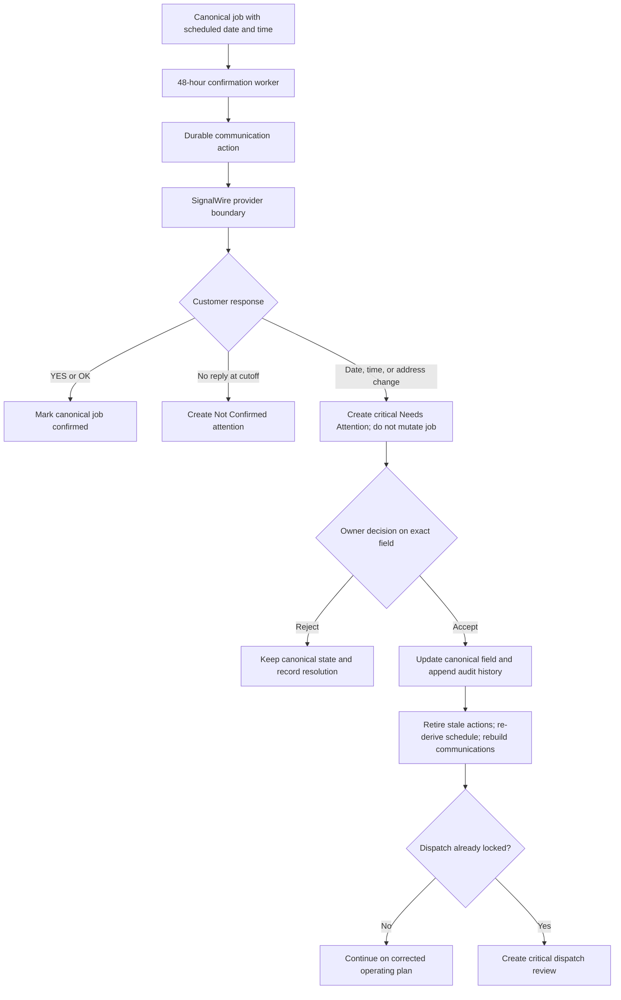
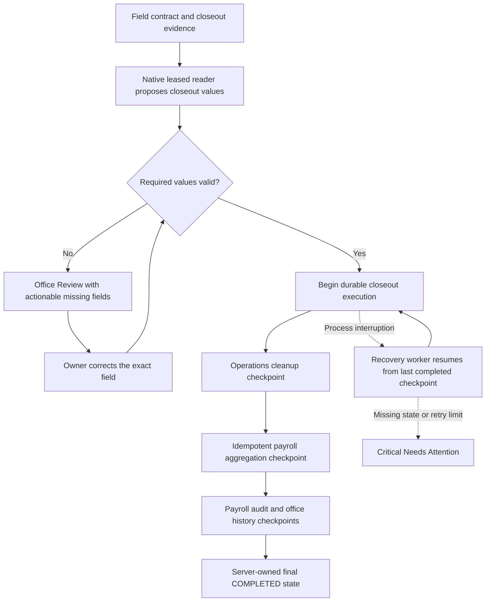

# JobSpark engineering proof

Updated October 9, 2026. Source snapshot: October 8, 2026, revision `704b423688358d5713754bfade0e1a2d37b55c93`.

JobSpark is a deployed operations execution system built independently by Kyle Spivey. It coordinates intake, canonical jobs, scheduling, crew and truck assignment, dispatch, field communications, contract review, closeout, payroll and history around shared operational state.

The engineering work is the connected behavior: a change to the accepted job affects dependent schedules and communications; incomplete evidence stops financial completion; retries resume saved work without crediting the same payroll twice.

[Try the public demo — no login](https://jobsparksystems.app/?demo=falcon) · [Product website](https://jobsparksystems.com)

## Current execution evidence

| Evidence | Recorded result | Scope |
|---|---|---|
| Current main CI | All four jobs passed on `704b423`: build and integrity, frontend dispatch hooks, production API dependency/startup, and reviewer browser workflow | [Run 37630119780](https://github.com/SKYBEAMS/jobSPARK/actions/runs/37630119780); source and test environment are pinned |
| Browser execution | **11 passed**, independently confirmed in the CI browser log | Chromium with isolated Auth, Firestore and Storage; reader output is controlled |
| Assignment and permissions | Saved job/truck/crew assignment survives refresh; restricted roles cannot perform guarded changes | Rendered UI plus persisted-state and HTTP denial assertions |
| Contract → review → payroll/history | Complete and incomplete contracts take distinct paths; missing price holds completion until office correction | Real local file selection/upload and Storage bytes; synthetic extraction proposal |
| Financial persistence | Eight actual hours at $25/$30 produce $200/$240 gross; one ledger row per crew member remains after repetition and refresh | Explicit fixture values, not customer payroll |
| Missing-field correction | A confirmed job without a date opens on the highlighted field; Enter saves the schedule and reload clears its warning | Isolated browser journey; live operator acceptance is separate |
| Deployed canary | October 6 operator report records the connected lifecycle, communications, actionable exceptions, closeout and History/payroll visibility | Live report carried into the dated record; no new canary was run for this publication |
| Saved-record and Health readback | Subsequent authenticated inspection found a completed job with two payroll ledger entries and a finished reader; deployed fixes cleared superseded extraction warnings | Recorded October 6–7 follow-up, not a continuous uptime or delivery measurement |

The live canary advances the evidence beyond a synthetic demonstration. Automated browser and emulator checks supply repeatable assertions for specific invariants; the live report supplies evidence that the deployed path has exercised real integrations. Exact live execution IDs, contract hashes and financial values still belong in the formal release record.

The source and CI links below require separately granted private-repository access. This public page contains no customer records, provider credentials or production payloads.

- [Current source revision](https://github.com/SKYBEAMS/jobSPARK/commit/704b423688358d5713754bfade0e1a2d37b55c93)
- [Reviewer handoff](https://github.com/SKYBEAMS/jobSPARK/blob/704b423688358d5713754bfade0e1a2d37b55c93/docs/REVIEWER_HANDOFF.md)
- [Dated live canary and deployment evidence](https://github.com/SKYBEAMS/jobSPARK/blob/704b423688358d5713754bfade0e1a2d37b55c93/docs/LIVE_CANARY_2026-10-06.md)
- [Subsystem test map](https://github.com/SKYBEAMS/jobSPARK/blob/704b423688358d5713754bfade0e1a2d37b55c93/docs/TEST_MAP.md)

## Engineering scale and counting method

These figures carry forward the October 8 numerical audit used for the updated engineering proof. Its source pin matches the repository main inspected for this update.

| Measure | Pinned source snapshot |
|---|---|
| Application source | **100,796 lines across 342 files** |
| Frontend | 181 files / 46,284 lines |
| Backend | 161 files / 54,512 lines |
| Test inventory | 146 tracked test files / 25,367 lines, counted separately |
| Literal HTTP route declarations | 105: 79 outside the demo router and 26 in the demo router |
| Selected action/history definitions | 16 allowed action types, 10 action-event types and 22 history-event types |
| Canonical action transition model | 7 states and 15 explicitly allowed transitions |
| Durable closeout execution | 7 persisted checkpoints |
| Data/configuration inventory | 43 unique literal collection references, 29 composite indexes, 5 configured workspaces and 5 role values |
| Direct model request locations | 3 OpenAI SDK request sites and 1 native Gemini HTTP request site; external Make calls are separate |

Application source means tracked `.ts/.tsx/.js` files under `src` and `server`, excluding test/spec files, `src/remotion`, the demo-history seed and the native HTTP test fixture. Executable demo runtime remains included. Counts include comments and blank lines; dependencies, generated builds, assets, documentation, scripts and lockfiles are excluded. The original audit matched counted files to their pinned GitHub blob SHAs.

**100,796 is a source-line count, not 100,796 lines of state-machine logic.** Route declarations are a static inventory, not a claim that every endpoint was exercised live. Configured workspaces are not paying customers. The action/history and transition counts describe named definitions, not every state machine or event in the system.

The older July 70,400-line / 245-file snapshot is historical. The old totals for 56 workflow groups, 21 machines, exceptions, repair paths and approval boundaries are retired as exhaustive current counts; the current proof uses named domains, source owners and test assertions.

## Tested behavior

The current [CI run](https://github.com/SKYBEAMS/jobSPARK/actions/runs/37630119780) includes strict server TypeScript, workspace and Storage rules, existing-session access removal, native extraction and durable closeout, dispatch lock/unlock/relock, communications recovery, lifecycle authority, payroll integrity and operational golden-path checks. Root typechecking also passes; whole-repository strict mode is not claimed.

The authenticated reviewer sandbox uses six synthetic role/workspace accounts and local Auth, Firestore and Storage. Its browser suite exercises assignment, upload, office correction, History/payroll, Health and missing-date correction. Controlled reader output makes the financial expectations reproducible; it does not measure real OCR accuracy.

### Historical September checkpoint

The following individually numbered results are retained as September 7, 2026 evidence. They are not relabeled as current test totals.

| Suite | Passed | What the tests check |
|---|---:|---|
| Closeout integrity | 22/22 | Interrupted closeouts can resume; concurrent and repeated closeouts credit payroll once; invalid closeouts remain in review |
| Crew assignment transactions | 15/15 | Incomplete snapshots and stale plans are rejected; competing plans cannot claim the same mover; rejected requests leave assignment records unchanged |
| Customer change lifecycle | 8/8 | Acceptance replaces old confirmation actions at the corrected 48-hour time, clears prior confirmation, records the decision, and creates critical review for locked dispatch |
| Communications recovery | 6/6 | Confirmed failures retry once; unknown delivery is held for critical review; interrupted accepted sends reconcile; provider dead letters surface and can be requeued |

The customer-change suite also checks rejection, stale evidence, wrong-job and wrong-workspace review items, competing accept/reject requests, and requests left open after a job is underway or finished.

The communications-recovery suite runs simultaneous recovery workers against the same records. It checks that a rejected outbound message produces one retry, uncertain delivery produces no resend, a provider-accepted message repairs one interrupted action, manual mode does not auto-retry, and a dead-letter inbound event can be surfaced and requeued.

One closeout test deliberately fails processing after payroll has been credited. It retries the command and checks that the employee still has three hours, not six. Another submits two closeouts simultaneously and checks for one payroll event and one completion event.

The assignment tests submit two plans competing for one mover. One succeeds. The other is rejected with its job, truck, and plan left unchanged.

These are results from specified test scenarios, not a guarantee for every failure or proof of live provider delivery. Source and CI logs remain private, so this page is a published summary rather than an independently runnable public test suite. Production messaging and worker uptime need separate checks.

## The Operating Problem

Field-service operations rarely fail because information does not exist. They fail because jobs, crews, vehicles, communications, evidence, and exceptions move through disconnected systems with unclear ownership and state.

JobSpark was designed to make the operation itself executable: every job has an explicit state, every important transition has a controlled path, and uncertainty is surfaced before it silently becomes an operational mistake.

## System Model

| Entity | Operational responsibility |
|---|---|
| Workspace | Isolates one company's configuration, users, records, and communication routes |
| Intake | Preserves source evidence and candidate job details |
| Job | Holds the canonical operational record and lifecycle state |
| Queue | Makes the next required operational action visible |
| Crew | Represents availability, skills, assignments, and working state |
| Truck | Coordinates a live dispatched operating unit |
| Communication | Preserves inbound/outbound provider evidence and delivery state |
| Contract | Captures field closeout evidence and extracted candidate values |
| Attention item | Converts missing, contradictory, or uncertain data into an actionable exception |
| Lifecycle event | Provides an auditable record of meaningful state changes |

## Execution Path


```mermaid
flowchart TD
    A["Source evidence"] --> B["Candidate operational data"]
    B --> C{"Deterministic validation"}
    C -->|Complete| D["Canonical job state"]
    C -->|Missing or conflicting| E["Needs Attention"]
    E --> F["Human resolution"]
    F --> D
    D --> G["Schedule and dispatch"]
    G --> H["Field execution"]
    H --> I["Closeout and history"]
```

The canonical job record is not a free-form AI document. Provider facts and source evidence are preserved first. Extracted details become candidates, deterministic rules decide whether they are operationally usable, and unresolved uncertainty becomes visible work.

## State and Safety Boundaries

- AI may extract, summarize, classify, or recommend.
- AI output does not independently overwrite canonical operational state.
- Recognized commands use explicit transition paths.
- Unknown or contradictory input fails toward review, not silent execution.
- Workspace identity is resolved before operational records are read or written.
- Public-demo activity runs in an isolated synthetic workspace with no customer data.
- Communications preserve provider identifiers and original message evidence.
- Retries are designed to avoid creating duplicate operational work.

## Reliability Design

### Idempotent intake and communications

External providers retry. JobSpark uses stable provider identifiers and deterministic record keys so the same delivery can be recognized instead of creating a second job, message, or exception.

### Controlled lifecycle transitions

Important state changes pass through explicit commands and validation. This keeps UI actions, provider webhooks, and background execution from becoming independent writers with different interpretations of the same job.

### Recoverable side effects

Operational state and external effects, such as communications, are tracked separately. A provider failure can remain visible and retryable without pretending the message was delivered or rolling back unrelated canonical work.

### Actionable uncertainty

Missing dates, addresses, customer details, closeout amounts, or unclear replies become attention items connected to the affected record and required field. The operator resolves the exception and resumes the existing flow.

### Auditable completion

Closeout preserves field evidence, detects missing values, routes incomplete records for review, and records the completed outcome in history and downstream payroll views.

## Communication Architecture

The SignalWire integration includes workspace-aware messaging and staged voice intake. Make remains the active automatic job-intake path. JobSpark now owns crew-link contract extraction through a server-side Gemini adapter and durable worker, enabled for controlled PVM verification. The old Make closeout path is retained for rollback. Autonomous mode controls automatic communications only.

The dated live canary records communications progression on the deployed path. The synthetic demo does not send live messages; sustained delivery, worker uptime and first-customer activation still require their own checks.

The integration contains controls for:

- Inbound provider-message preservation
- Deterministic workspace resolution by configured number
- Duplicate-delivery protection
- STOP and HELP handling
- Delivery-status tracking
- Unknown operational corrections routed to human review
- Media evidence retained for closeout processing

## Customer confirmation and controlled changes

A customer reply can confirm the plan, but it cannot silently rewrite live operations.


```mermaid
flowchart TD
    A["Canonical job with scheduled date and time"] --> B["48-hour confirmation worker"]
    B --> C["Durable communication action"]
    C --> D["SignalWire provider boundary"]
    D --> E{"Customer response"}
    E -->|"YES or OK"| F["Mark canonical job confirmed"]
    E -->|"No reply at cutoff"| G["Create Not Confirmed attention"]
    E -->|"Date, time, or address change"| H["Create critical Needs Attention; do not mutate job"]
    H --> I{"Owner decision on exact field"}
    I -->|"Reject"| J["Keep canonical state and record resolution"]
    I -->|"Accept"| K["Update canonical field and append audit history"]
    K --> L["Retire stale actions; re-derive schedule; rebuild communications"]
    L --> M{"Dispatch already locked?"}
    M -->|"No"| N["Continue on corrected operating plan"]
    M -->|"Yes"| O["Create critical dispatch review"]
```

This preserves the difference between customer evidence and accepted operating truth. A schedule change also invalidates old confirmation, crew-check-in, and timing actions so the system cannot execute yesterday's plan against today's job.

## Closeout, recovery, and payroll

Completion is a controlled workflow, not a status button.


```mermaid
flowchart TD
    A["Field contract and closeout evidence"] --> B["Native leased reader proposes closeout values"]
    B --> C{"Required values valid?"}
    C -->|"No"| D["Office Review with actionable missing fields"]
    D --> E["Owner corrects the exact field"]
    E --> C
    C -->|"Yes"| F["Begin durable closeout execution"]
    F --> G["Operations cleanup checkpoint"]
    G --> H["Idempotent payroll aggregation checkpoint"]
    H --> I["Payroll audit and office history checkpoints"]
    I --> J["Server-owned final COMPLETED state"]
    F -. "Process interruption" .-> K["Recovery worker resumes from last completed checkpoint"]
    K --> F
    K -. "Missing state or retry limit" .-> L["Critical Needs Attention"]
```

Each stage records its completion. Replaying the workflow skips completed stages, protects payroll from double counting, and stops unsafe contradictions for owner review. A separate drift worker is designed to check that terminal job, truck, crew, closeout, and payroll markers still agree.


The native reader stores proposals, leases each processing attempt and checks evidence/version consistency before committing. Interrupted processing can resume; incomplete or contradictory evidence goes to Office Review. Storage rules and real Admin uploads are covered locally, including role/workspace denials and explicit emulator token revocation. The deployed October 7 application checkpoint is recorded separately from current source CI in the live evidence record.

## Deployment and Validation

| Layer | Implementation |
|---|---|
| Web application | React, TypeScript, Vite, Tailwind CSS |
| API | Node.js, Express, TypeScript |
| Persistence and identity | Firestore, Firebase Authentication, Firebase Storage |
| Communications | SignalWire |
| Intake and model services | Make intake, bounded OpenAI requests, native Gemini contract reader |
| Delivery | GitHub Actions, Vercel, Render |

Validation focuses on operational invariants rather than screenshots alone: lifecycle transitions, duplicate deliveries, closeout integrity, side-effect resilience, crew replies, access boundaries, and production builds.

## What the demo shows

The public experience uses synthetic data to demonstrate the operating sequence without exposing customer information:

1. Load operational resources.
2. Convert intake into visible queues.
3. Resolve incomplete or non-job calls.
4. Promote jobs according to state and date.
5. Schedule crews and trucks.
6. Lock the dispatch state.
7. Receive field contracts.
8. Route incomplete closeout evidence for review.
9. Process closeout into history and downstream payroll records.

This is a guided synthetic scenario. It does not establish real SMS delivery, worker uptime, or a customer's deployment readiness.

[Enter the JobSpark interactive demo](https://jobsparksystems.app/?demo=falcon)

## Review and remaining release evidence

Authorized reviewers can reproduce the local evidence with Node 22 and Java 17, using a fresh private-repository checkout:

```sh
npm ci
npm run review:check
npm run sandbox:browser
```

The reviewer runner supplies synthetic configuration and rejects local environment files. Browser checks run separately. Follow the pinned reviewer handoff for setup and fixture boundaries.

The current evidence establishes a deployed connected path, recorded live-canary success, and passing checks for specified operational and financial invariants. It does not establish sustained paying-customer operation, measured ROI, universal OCR accuracy, an independently audited system or formal pilot acceptance.

Remaining release evidence includes independent published Firebase/Storage policy and IAM readback, legacy broad-key retirement and outside-caller cutover, exact persisted live-canary identities/values, production acceptance of the missing-field correction, and messy-photo/multi-job payroll pilot checks. The operational kernel is implemented within JobSpark; a separately portable cross-industry kernel remains unproven.

This public repository publishes architecture, evidence summaries and counting definitions. Application code, tests, CI configuration and customer configuration remain private. Repository access is granted separately.
